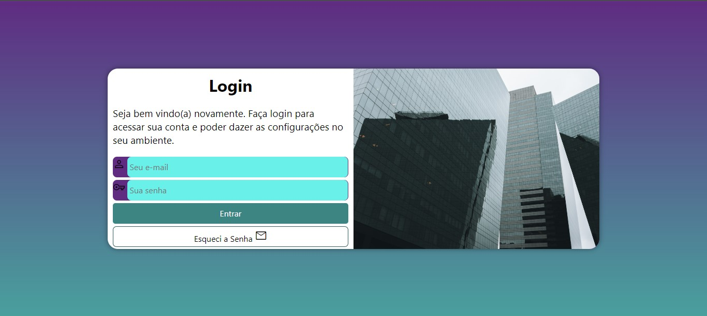

# Projeto Login

> Projeto criado durante o curso de HTML e CSS do Curso em Vídeo. O objetivo do projeto é de construirmos uma tela de login.

### Ajustes e melhorias

O projeto está em constante melhorias e aberto a críticas, elogios ou sugestões. As próximas atualizações serão voltadas nas seguintes tarefas:

- [ ] Atualização do CSS
- [ ] Alteração das imagens

## 💻 Pré-requisitos

Antes de começar, verifique se você atendeu aos seguintes requisitos:

- Um computador com um navegador instalado

## ☕ Usando Projeto Login

Para acessar o portfólio, siga estas etapas:

- Acesse o seguinte link: https://maurochavesjr.github.io/projeto-login/

## 📫 Contribuindo para Projeto Login

Para contribuir com o Projeto Login, siga estas etapas:

1. Bifurque este repositório.
2. Crie um branch: `git checkout -b <nome_branch>`.
3. Faça suas alterações e confirme-as: `git commit -m '<mensagem_commit>'`
4. Envie para o branch original: `git push origin <nome_do_projeto> / <local>`
5. Crie a solicitação de pull.

Como alternativa, consulte a documentação do GitHub em [como criar uma solicitação pull](https://help.github.com/en/github/collaborating-with-issues-and-pull-requests/creating-a-pull-request).

## 🤝 Colaboradores

Agradecemos às seguintes pessoas que contribuíram para este projeto:

<table>
  <tr>
    <td align="center">
      <a href="#" title="defina o titulo do link">
         
        
          <b>Mauro Chaves Jr</b>
        
      </a>
    </td>
  </tr>
</table>

